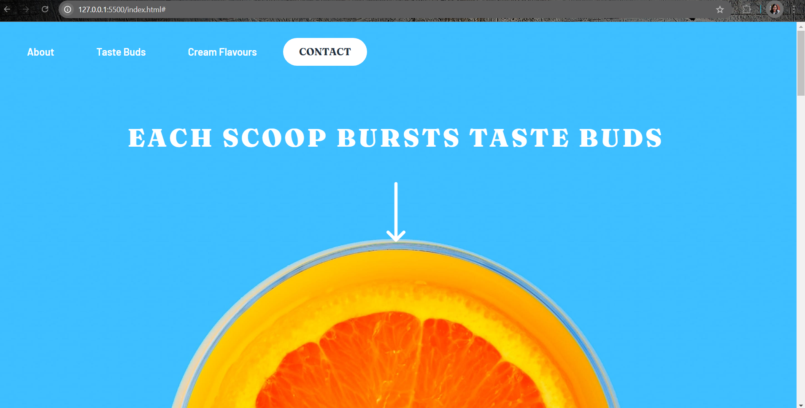
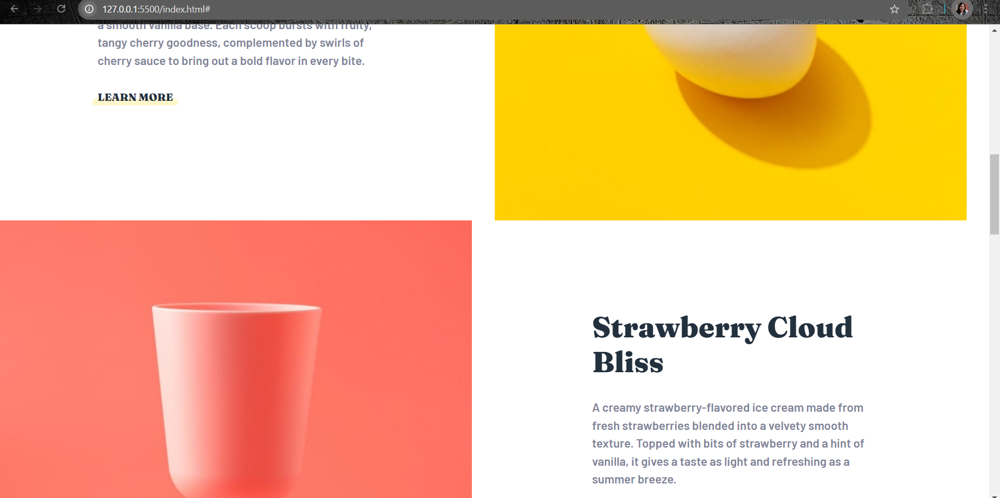
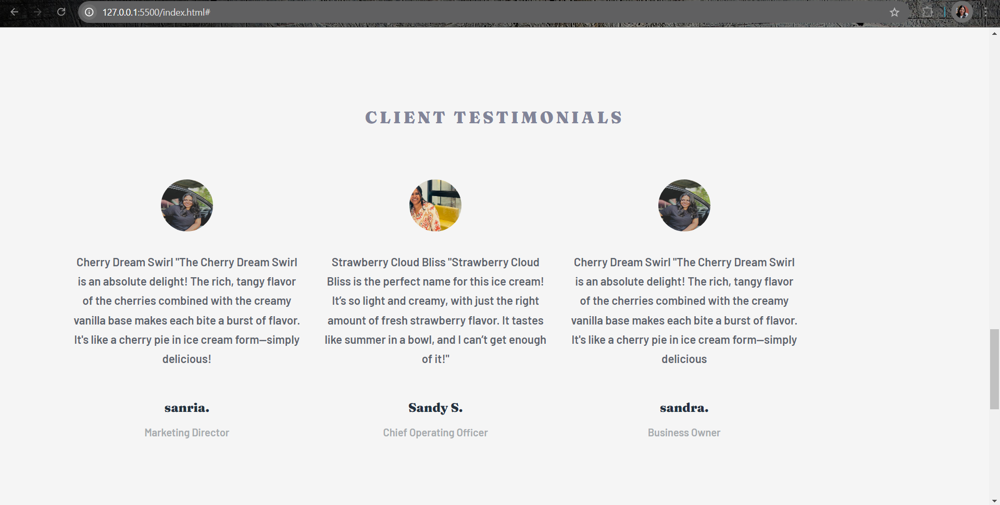
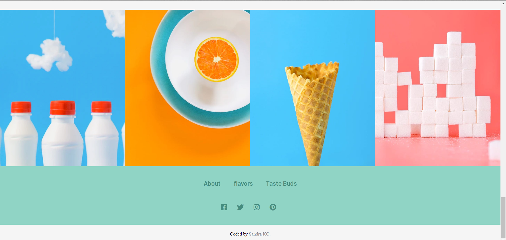

# **Sandy Swirls - Landing Page**

Welcome to the **Sandy Swirls** landing page repository! This project showcases a modern, responsive landing page designed with React, HTML, CSS, and Bootstrap.

## 🏠 **Overview**

Sandy Swirls is a premium ice cream brand, and this landing page is built to highlight our delicious flavors, unique branding, and an engaging user experience.

---

## 🛠️ **Tech Stack**

The technologies used in this project are:

-  **React** - A JavaScript library for building user interfaces.
-  **HTML5** - Markup language for structuring content.
-  **CSS3** - Styling language for presentation.
-  **Bootstrap** - Framework for building responsive, mobile-first sites.

---

## 🖼️ **Screenshots**

Below are screenshots from the project to help visualize the design and layout:

### 1. **Landing Page Hero Section**  


### 2. **Flavors Showcase**  


### 3. **About Us Section**  


### 4. **Contact Us Form**  


---

## 🚀 **Installation and Setup**

Follow the steps below to get a local copy of the project up and running:

1. **Clone the Repository:**
   ```bash
   git clone https://github.com/your-username/sandy-swirls-landing.git
   cd sandy-swirls-landing
